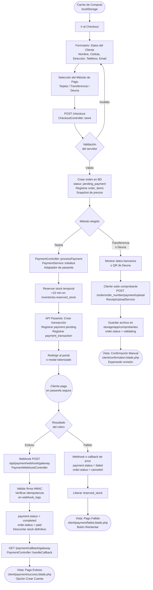

# Documento: Flujos de Procesos y Workflows

## 1. Objetivos del Documento
Diagramar y detallar paso a paso los procesos lógicos y operativos de **Almacenes al Costo**, incluyendo el flujo completo del Checkout y el ciclo de validación de pedidos manuales.

---

## 2. Flujo Completo del Checkout

El siguiente diagrama representa el flujo definitivo desde el carrito hasta la confirmación, incluyendo la bifurcación por método de pago.



---

## 3. Flujo de Validación Manual (Panel Administrativo)

```mermaid
sequenceDiagram
    actor Administrador
    participant Panel as Admin Panel
    participant Laravel as Servidor (Laravel)
    database DB as Base de Datos (MySQL)
    actor Cliente

    Administrador->>Panel: Accede a Pedidos → Filtro: Validando
    Panel->>Laravel: GET /admin/orders?status=validating
    Laravel->>DB: Consulta órdenes con status = validating
    Laravel-->>Panel: Lista de pedidos con comprobante
    Administrador->>Panel: Abre detalle del pedido
    Panel->>Laravel: GET /admin/orders/{id}/receipt (Ruta protegida)
    Laravel-->>Panel: Binario del archivo (Storage::response())
    Administrador->>Administrador: Verifica fondos en banco/Deuna

    alt Fondos confirmados
        Administrador->>Panel: Clic en "Aprobar"
        Panel->>Laravel: POST /admin/orders/{id}/approve
        Laravel->>DB: order.status = approved
        Laravel->>DB: Descontar stock definitivo en inventories
        Laravel-->>Administrador: Confirmación de aprobación
    else Comprobante inválido o fondos incorrectos
        Administrador->>Panel: Clic en "Rechazar" + Motivo
        Panel->>Laravel: POST /admin/orders/{id}/reject (motivo)
        Laravel->>DB: order.status = pending_payment
        Laravel->>DB: payment_receipts.rejection_reason = motivo
        Laravel-->>Administrador: Confirmación de rechazo
    end
```

---

## 4. Referencias y Dependencias
*   [01-business/README.md](file:///c:/xampp/htdocs/Almacenes-al-Costo/spec/01-business/README.md)
*   [01-business/01-business-rules.md](file:///c:/xampp/htdocs/Almacenes-al-Costo/spec/01-business/01-business-rules.md)
*   [03-architecture/02-integration-diagrams.md](file:///c:/xampp/htdocs/Almacenes-al-Costo/spec/03-architecture/02-integration-diagrams.md)
*   [06-backend/02-controllers.md](file:///c:/xampp/htdocs/Almacenes-al-Costo/spec/06-backend/02-controllers.md)
