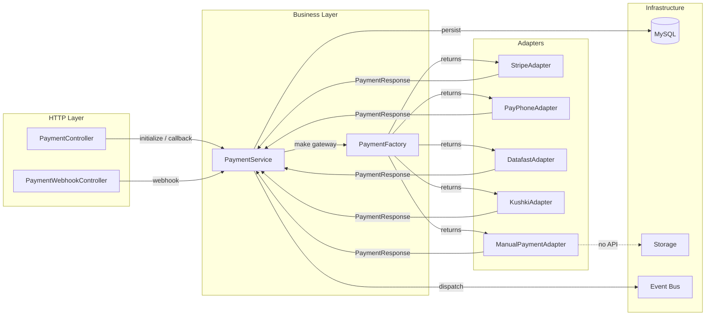

# Documento: Arquitectura General del Sistema

> **Vigencia:** Strategy/Adapter se conserva como evolución futura. El MVP implementa pago manual sin exigir fábrica, adaptadores o webhook.

## 1. Objetivos del Documento
Definir los patrones de diseño, componentes técnicos y la estrategia de modularidad/desacoplamiento de la aplicación **Almacenes al Costo**.

---

## 2. Tipo de Arquitectura

*   **Modelo Monolítico**: Laravel gestiona la lógica del servidor, el acceso a datos (Eloquent ORM) y el renderizado de UI (plantillas Blade). No se usan APIs separadas ni frontends desacoplados.

---

## 3. Arquitectura del Módulo de Pagos (Patrón Strategy + Adapter)

El módulo de pagos es el componente de mayor complejidad técnica del sistema. Está diseñado para ser completamente desacoplado del flujo de checkout mediante dos patrones de diseño:

*   **Strategy**: El `PaymentService` no conoce la implementación concreta de ninguna pasarela. Trabaja siempre contra el contrato `PaymentGatewayInterface`.
*   **Adapter**: Cada adaptador (`StripeAdapter`, `PayPhoneAdapter`, etc.) traduce el contrato interno del sistema al protocolo específico de la pasarela externa.

### 3.1 Componentes y Responsabilidades

```
CheckoutController / PaymentController / PaymentWebhookController
    ↓ (delegan en)
PaymentService                        ← Orquestador (persistencia, eventos, estados)
    ↓ (usa)
PaymentFactory                        ← Resuelve qué adaptador instanciar
    ↓ (produce)
PaymentGatewayInterface               ← Contrato unificado (patrón Strategy)
    ↓ (implementado por)
StripeAdapter / PayPhoneAdapter / DatafastAdapter / KushkiAdapter / ManualPaymentAdapter
    ↓ (devuelven)
PaymentResponse (DTO)                 ← Formato estándar de respuesta
```

### 3.2 Descripción de Componentes

| Componente | Namespace | Responsabilidad única |
| :--- | :--- | :--- |
| `PaymentGatewayInterface` | `App\Contracts` | Definir el contrato: `initializePayment`, `handleCallback`, `handleWebhook`, `validateSignature`. |
| `PaymentFactory` | `App\Services\Payments` | Instanciar el adaptador correcto según el gateway. Inyectar credenciales desde config. |
| `PaymentService` | `App\Services\Payments` | Orquestar el flujo: persistencia en BD, despacho de eventos, coordinación con adaptadores. |
| `*Adapter` | `App\Services\Payments` | Traducir el lenguaje del sistema al protocolo de cada pasarela y viceversa. No persiste en BD. |
| `ManualPaymentAdapter` | `App\Services\Payments` | Implementar el contrato para pagos manuales. No contacta APIs externas. |
| `PaymentResponse` | `App\DTOs` | DTO que estandariza la comunicación entre adaptadores y el `PaymentService`. |

### 3.3 Regla de Adición de Nuevas Pasarelas

Para agregar un nuevo proveedor de pago en el futuro:
1.  Crear `NuevoPasarelaAdapter.php` implementando `PaymentGatewayInterface`.
2.  Registrar el nuevo gateway en `PaymentFactory::make()`.
3.  Agregar las variables de entorno necesarias en `.env` y `config/services.php`.
4.  **No se requiere modificar** el `PaymentService`, el `PaymentController` ni el `CheckoutController`.

---

## 4. Flujo de Datos del Módulo de Pagos



---

## 5. Arquitectura de Eventos y Jobs

El sistema usa el Event Bus de Laravel para desacoplar efectos secundarios (emails, descuento de inventario) de la lógica principal de negocio. Ver documentación completa en:
*   [06-backend/05-events.md](file:///c:/xampp/htdocs/Almacenes-al-Costo/spec/06-backend/05-events.md) — Catálogo de eventos y listeners.
*   [06-backend/06-jobs.md](file:///c:/xampp/htdocs/Almacenes-al-Costo/spec/06-backend/06-jobs.md) — Jobs asíncronos y tareas programadas.

---

## 6. Referencias y Dependencias
*   [03-architecture/README.md](file:///c:/xampp/htdocs/Almacenes-al-Costo/spec/03-architecture/README.md)
*   [03-architecture/04-webhooks.md](file:///c:/xampp/htdocs/Almacenes-al-Costo/spec/03-architecture/04-webhooks.md)
*   [06-backend/04-services-helpers.md](file:///c:/xampp/htdocs/Almacenes-al-Costo/spec/06-backend/04-services-helpers.md)
*   [11-decisions/04-adr-integracion-pasarela.md](file:///c:/xampp/htdocs/Almacenes-al-Costo/spec/11-decisions/04-adr-integracion-pasarela.md)
