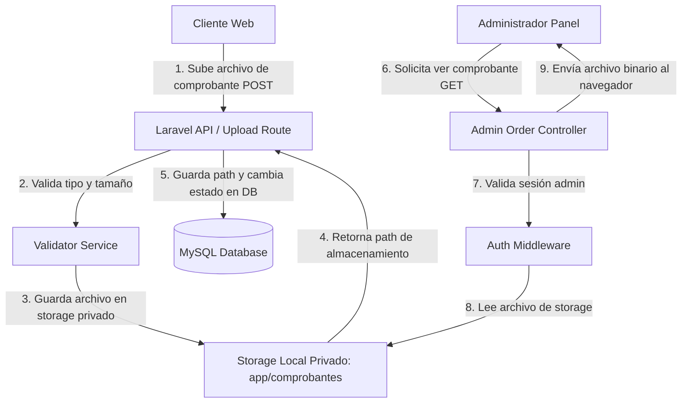

# Documento: Diagramas de Integración y Flujo de Datos

## 1. Objetivos del Documento
Ilustrar gráficamente el flujo de datos lógicos y la integración entre los servicios del sistema, especialmente para el almacenamiento seguro de comprobantes y persistencia del carrito.

## 2. Diagrama de Flujo de Datos (Carga y Validación de Comprobante)


## 3. Diagrama de Secuencia - Pasarela de Pagos Automática
```mermaid
sequenceDiagram
    actor Cliente
    participant Browser as Navegador (JS)
    participant Laravel as Servidor (Laravel)
    participant Gateway as API Pasarela (Stripe/Kushki/etc)
    database DB as Base de Datos (MySQL)

    Cliente->>Browser: Selecciona Tarjeta y confirma checkout
    Browser->>Laravel: POST /checkout (Datos cliente + Carrito)
    Laravel->>DB: Registra Orden ("pending") e inactiva stock temporal
    Laravel->>Laravel: PaymentService resuelve Adaptador según config
    Laravel->>Gateway: API Request: Crear Transacción (Monto, ID Orden, Callback, Webhook)
    Gateway-->>Laravel: Response: URL de Pago y ID Transacción
    Laravel->>DB: Registra en `payments` ("pending") y `payment_transactions` (Payload)
    Laravel-->>Browser: JSON con URL de redirección
    Browser->>Gateway: Redirecciona al portal de pago seguro
    Cliente->>Gateway: Ingresa datos de tarjeta y aprueba pago
    Gateway->>Gateway: Procesa cobro
    
    par Notificación Servidor a Servidor (Asíncrona)
        Gateway->>Laravel: POST /api/payment/webhook/{gateway} (Firma en cabecera)
        Note over Laravel: WebhookController valida firma y previene reprocesamiento
        Laravel->>DB: Registra `webhook_logs` (Idempotencia)
        Laravel->>DB: Actualiza `payments` ("completed") y `orders` ("PAGADO")
        Laravel->>DB: Descuenta stock físicamente en `inventories` (Definitivo)
        Laravel-->>Gateway: HTTP 200 OK
    and Redirección del Cliente (Síncrona)
        Gateway-->>Browser: Redirecciona al Callback URL
        Browser->>Laravel: GET /order/callback/{gateway}?order_number=XXX
        Laravel->>DB: Consulta estado de orden en DB
        Laravel-->>Browser: Renderiza vista de Pago Exitoso ("PAGADO") con opción de Crear Cuenta
    end
```

## 4. Referencias y Dependencias
*   [03-architecture/README.md](file:///c:/xampp/htdocs/Almacenes-al-Costo/spec/03-architecture/README.md)
*   [08-security/02-upload-security.md](file:///c:/xampp/htdocs/Almacenes-al-Costo/spec/08-security/02-upload-security.md)

