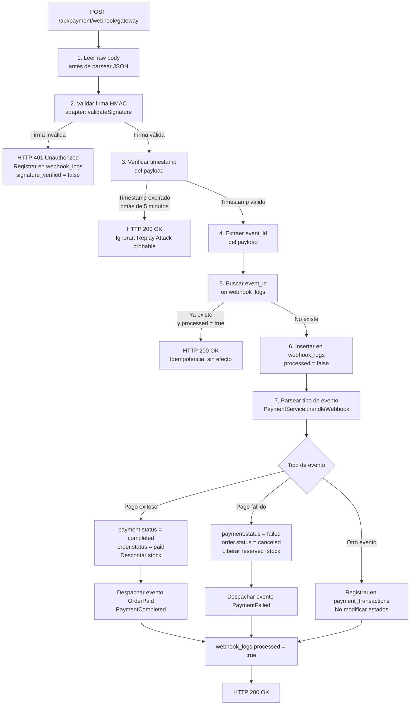

# Documento: Especificación Completa de Webhooks

## 1. Objetivos del Documento
Definir exhaustivamente el protocolo de recepción, validación, procesamiento y manejo de errores de los webhooks de pasarelas de pago, garantizando seguridad, idempotencia y trazabilidad completa.

> **Fuente de referencia**: Este documento define el comportamiento de `PaymentWebhookController` y el método `PaymentService::handleWebhook()`. Cualquier implementación debe adherirse a esta especificación.

---

## 2. Endpoint de Recepción

*   **Ruta**: `POST /api/payment/webhook/{gateway}`
*   **Nombre de ruta**: `payment.webhook`
*   **Controlador**: `App\Http\Controllers\PaymentWebhookController@handleWebhook`
*   **Middleware**: Excluido de verificación CSRF (configurar en `App\Http\Middleware\VerifyCsrfToken::$except`).
*   **Parámetro `{gateway}`**: String identificador de la pasarela (`stripe`, `payphone`, `datafast`, `kushki`). Permite que un único controlador gestione todos los proveedores.

---

## 3. Secuencia de Procesamiento del Webhook

El siguiente orden es **obligatorio** y no puede alterarse:

---

## 4. Validación de Firma

### 4.1 Principio General
Cada pasarela incluye una firma criptográfica en los headers HTTP para garantizar que el webhook proviene realmente de la pasarela y no de un actor malicioso. **La firma DEBE validarse antes de procesar cualquier dato del payload.**

### 4.2 Especificación por Pasarela

| Pasarela | Header de firma | Algoritmo |
| :--- | :--- | :--- |
| Stripe | `Stripe-Signature` | HMAC-SHA256 sobre el raw body + timestamp |
| PayPhone | `Authorization: Bearer {token}` | Token fijo configurado en panel de PayPhone |
| Datafast | `X-Datafast-Signature` | HMAC-SHA256 con clave compartida |
| Kushki | `Private-Merchant-Id` | Validación de merchant ID contra clave privada |

### 4.3 Clave de Validación
Las claves de firma se almacenan en las variables de entorno (`.env`) y en la tabla `settings`. **Nunca** en código fuente.

---

## 5. Prevención de Replay Attack

Un Replay Attack ocurre cuando un actor malicioso intercepta y reenvía un webhook legítimo para disparar un cobro duplicado.

**Medidas implementadas**:

1.  **Validación de timestamp**: El payload de la pasarela incluye un timestamp de creación del evento. Si el timestamp es anterior a **5 minutos** del tiempo actual del servidor, el webhook se descarta con HTTP 200 (sin procesar).
2.  **Idempotencia por `event_id`**: El `event_id` (identificador único del evento asignado por la pasarela) se almacena en `webhook_logs`. Si el mismo `event_id` llega de nuevo, se responde con HTTP 200 sin efectos secundarios.
3.  **Raw body para validación**: La firma se calcula sobre el **cuerpo crudo (raw body)** de la solicitud, no sobre el JSON parseado. Laravel debe leer el raw body **antes** de que el framework lo parsee.

---

## 6. Idempotencia

La idempotencia garantiza que procesar el mismo evento múltiples veces produce el mismo resultado que procesarlo una sola vez.

**Implementación**:

| Campo en `webhook_logs` | Rol en idempotencia |
| :--- | :--- |
| `event_id` (UNIQUE) | Identificador único del evento de la pasarela. La restricción UNIQUE en BD previene inserciones duplicadas. |
| `processed` (BOOLEAN) | Indica si el evento ya fue aplicado al sistema. Solo se lee y escribe, nunca se sobreescribe a `false`. |
| `processing_error` (TEXT) | Si el procesamiento falló (excepción), se registra el error aquí y `processed` permanece `false` para reintento controlado. |

---

## 7. Reintentos de la Pasarela

Las pasarelas reenvían webhooks automáticamente si no reciben un HTTP 200 en cierto tiempo. El sistema debe estar preparado para esto:

*   **Siempre responder HTTP 200** a la pasarela en los siguientes casos:
    *   Firma validada y evento procesado con éxito.
    *   Evento ya procesado (idempotencia).
    *   Timestamp expirado (Replay Attack probable).
*   **Responder HTTP 4xx o 5xx SOLO si**:
    *   La firma es inválida (`401`).
    *   El gateway no es reconocido (`400`).
*   **NO responder 5xx** por errores de procesamiento interno: esto causaría que la pasarela reintente indefinidamente. Los errores internos se registran en `webhook_logs.processing_error` y se manejan internamente.

---

## 8. Registro de Eventos

Todo webhook recibido se registra en **dos tablas** con propósitos distintos:

### 8.1 Tabla `webhook_logs` — Control y Auditoría
Registro de **cada solicitud HTTP recibida** desde la pasarela. Propósito: idempotencia, seguridad y auditoría de nivel HTTP.

| Campo | Qué registra |
| :--- | :--- |
| `gateway` | Pasarela emisora |
| `event_type` | Tipo de evento (ej. `payment_intent.succeeded`) |
| `event_id` | ID único del evento para idempotencia |
| `payload` | Raw body completo recibido |
| `signature_verified` | Si la firma HMAC fue válida |
| `processed` | Si el evento fue aplicado al sistema |
| `processing_error` | Error si el procesamiento falló |

### 8.2 Tabla `payment_transactions` — Historial de Transacciones
Registro de **los eventos relevantes para el pago específico** una vez verificada la firma. Propósito: trazabilidad del ciclo de vida del cobro.

| `event_type` | Cuándo se registra |
| :--- | :--- |
| `request` | Al enviar la solicitud inicial a la pasarela |
| `response` | Al recibir la respuesta de la pasarela al crear la transacción |
| `callback_received` | Al recibir el retorno síncrono del cliente (callback URL) |
| `webhook_received` | Al recibir y procesar un webhook válido |
| `error` | Al recibir un error de la pasarela en cualquier punto |

---

## 9. Manejo de Errores

| Escenario | Acción del sistema | Respuesta HTTP |
| :--- | :--- | :--- |
| Firma inválida | Registrar en `webhook_logs` (`signature_verified = false`). No procesar. | `401 Unauthorized` |
| Gateway no reconocido | Log de error. No procesar. | `400 Bad Request` |
| Timestamp expirado (> 5 min) | Registrar y descartar silenciosamente. | `200 OK` |
| `event_id` ya procesado | Responder inmediatamente sin efectos. | `200 OK` |
| Excepción durante procesamiento | Registrar en `webhook_logs.processing_error`. Notificar a admin internamente. | `200 OK` |
| Orden no encontrada en BD | Registrar error. Investigar manualmente. | `200 OK` |

---

## 10. Estados Post-Webhook

Tras el procesamiento exitoso de un webhook, los estados actualizados son:

| Tipo de webhook | `payments.status` | `orders.status` | `inventories` |
| :--- | :--- | :--- | :--- |
| Pago exitoso | `completed` | `paid` | `stock -= qty`, `reserved_stock -= qty` |
| Pago fallido | `failed` | `canceled` | `reserved_stock -= qty` (liberar reserva) |
| Pago expirado | `expired` | `canceled` | `reserved_stock -= qty` (liberar reserva) |
| Reembolso | `refunded` | `canceled` (o mantiene según política) | No aplica en V1.0 |

---

## 11. Referencias y Dependencias
*   [06-backend/02-controllers.md](file:///c:/xampp/htdocs/Almacenes-al-Costo/spec/06-backend/02-controllers.md)
*   [06-backend/04-services-helpers.md](file:///c:/xampp/htdocs/Almacenes-al-Costo/spec/06-backend/04-services-helpers.md)
*   [05-database/02-schema-definition.md](file:///c:/xampp/htdocs/Almacenes-al-Costo/spec/05-database/02-schema-definition.md)
*   [08-security/02-upload-security.md](file:///c:/xampp/htdocs/Almacenes-al-Costo/spec/08-security/02-upload-security.md)
*   [10-deployment/01-env-variables.md](file:///c:/xampp/htdocs/Almacenes-al-Costo/spec/10-deployment/01-env-variables.md)
