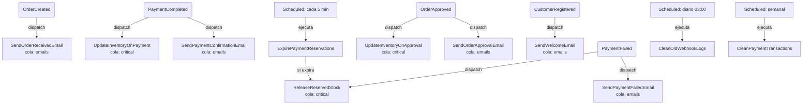

# Documento: Jobs y Procesos Asíncronos

> **Vigencia:** notificaciones y operaciones aplicables al flujo manual pueden estar en el MVP. Jobs exclusivos de tarjeta/webhook y limpieza de logs externos son futuros. Reservas pertenecen a EP-008/EP-004.

## 1. Objetivos del Documento
Documentar los procesos asíncronos (Jobs y Scheduled Tasks) de **Almacenes al Costo**, especificando su propósito, cuándo se despachan, su prioridad en cola y sus efectos en el sistema.

> **Principio**: Los Jobs permiten que las operaciones costosas o temporalmente diferibles no bloqueen el ciclo de respuesta HTTP. Para el MVP en entorno local XAMPP, los jobs pueden ejecutarse en modo `sync` (inmediato) o mediante una cola básica (`database`).

---

## 2. Configuración de Colas (MVP)

| Parámetro | Valor MVP |
| :--- | :--- |
| Driver de cola | `database` (tabla `jobs` de Laravel) |
| Cola por defecto | `default` |
| Cola de emails | `emails` |
| Cola crítica | `critical` (reservar stock, descontar inventario) |
| Comando para procesar | `php artisan queue:work --queue=critical,default,emails` |

---

## 3. Catálogo de Jobs

### 3.1 `App\Jobs\SendOrderReceivedEmail`

| Atributo | Detalle |
| :--- | :--- |
| **Disparado por** | Listener de `OrderCreated` |
| **Cola** | `emails` |
| **Propósito** | Enviar email de confirmación de recibo del pedido al cliente. El email confirma que el pedido fue registrado, **no** que fue pagado. |
| **Datos que recibe** | Modelo `Order` (con `items` e `customer_email`). |
| **Efecto** | Email enviado al cliente con el número de pedido, resumen de ítems y próximos pasos según método de pago elegido. |
| **Manejo de fallos** | 3 reintentos con backoff de 60 segundos. Fallo silencioso (el pedido ya fue creado). |

---

### 3.2 `App\Jobs\SendPaymentConfirmationEmail`

| Atributo | Detalle |
| :--- | :--- |
| **Disparado por** | Listener de `PaymentCompleted` |
| **Cola** | `emails` |
| **Propósito** | Notificar al cliente que su pago con tarjeta fue confirmado exitosamente. |
| **Datos que recibe** | Modelo `Order`, modelo `Payment`, string `$transactionId`. |
| **Efecto** | Email al cliente con ID de transacción, monto cobrado y estado `Pagado`. |
| **Manejo de fallos** | 3 reintentos con backoff de 60 segundos. |

---

### 3.3 `App\Jobs\SendPaymentFailedEmail`

| Atributo | Detalle |
| :--- | :--- |
| **Disparado por** | Listener de `PaymentFailed` |
| **Cola** | `emails` |
| **Propósito** | Notificar al cliente que su pago fue rechazado e invitarlo a reintentar. |
| **Datos que recibe** | Modelo `Order`, modelo `Payment`, string `$reason`. |
| **Efecto** | Email con motivo del rechazo y enlace directo para reintentar el pago. |
| **Manejo de fallos** | 3 reintentos con backoff de 60 segundos. |

---

### 3.4 `App\Jobs\SendOrderApprovalEmail`

| Atributo | Detalle |
| :--- | :--- |
| **Disparado por** | Listener de `OrderApproved` |
| **Cola** | `emails` |
| **Propósito** | Notificar al cliente que el administrador verificó su comprobante y el pedido está aprobado. |
| **Datos que recibe** | Modelo `Order`. |
| **Efecto** | Email al cliente con confirmación de aprobación y próximos pasos de despacho. |
| **Manejo de fallos** | 3 reintentos. |

---

### 3.5 `App\Jobs\SendWelcomeEmail`

| Atributo | Detalle |
| :--- | :--- |
| **Disparado por** | Listener de `CustomerRegistered` |
| **Cola** | `emails` |
| **Propósito** | Email de bienvenida al cliente que registra su cuenta post-compra. |
| **Datos que recibe** | Modelo `User`. |
| **Efecto** | Email de bienvenida con enlace a historial de pedidos. |
| **Manejo de fallos** | 3 reintentos. |

---

### 3.6 `App\Jobs\UpdateInventoryOnPayment`

| Atributo | Detalle |
| :--- | :--- |
| **Disparado por** | Listener de `PaymentCompleted` |
| **Cola** | `critical` |
| **Propósito** | Descontar el stock físico y liberar el `reserved_stock` tras un pago exitoso por pasarela. |
| **Datos que recibe** | Modelo `Order` (con `items`). |
| **Efecto** | Para cada `order_item`: decrementa `inventories.stock` en `quantity` y decrementa `inventories.reserved_stock` en `quantity`. Si `stock <= min_stock`, despacha `InventoryUpdated`. |
| **Manejo de fallos** | 5 reintentos. Si falla permanentemente, registrar en log de error crítico y notificar al admin. |
| **Prioridad** | **Alta** — Error en este job puede generar sobreventas. |

---

### 3.7 `App\Jobs\UpdateInventoryOnApproval`

| Atributo | Detalle |
| :--- | :--- |
| **Disparado por** | Listener de `OrderApproved` |
| **Cola** | `critical` |
| **Propósito** | Descontar el stock físico tras aprobación manual de comprobante. Para pagos manuales **no** hay `reserved_stock`, el descuento es directo. |
| **Datos que recibe** | Modelo `Order` (con `items`). |
| **Efecto** | Para cada `order_item`: decrementa `inventories.stock` en `quantity`. Si `stock <= min_stock`, despacha `InventoryUpdated`. |
| **Manejo de fallos** | 5 reintentos. Notificar al admin si falla. |
| **Prioridad** | **Alta** |

---

### 3.8 `App\Jobs\ReleaseReservedStock`

| Atributo | Detalle |
| :--- | :--- |
| **Disparado por** | Listener de `PaymentFailed` / Job programado `ExpirePaymentReservations` |
| **Cola** | `critical` |
| **Propósito** | Liberar el stock temporalmente reservado cuando un pago falla o expira. |
| **Datos que recibe** | Modelo `Order` o colección de órdenes expiradas. |
| **Efecto** | Para cada `order_item`: decrementa `inventories.reserved_stock` en `quantity`. |
| **Manejo de fallos** | 5 reintentos. |

---

## 4. Tareas Programadas (Scheduled Commands)

### 4.1 `ExpirePaymentReservations` (Cada 5 minutos)

| Atributo | Detalle |
| :--- | :--- |
| **Frecuencia** | Cada 5 minutos (`everyFiveMinutes()` en `Kernel.php`) |
| **Propósito** | Detectar y cancelar pedidos cuya reserva de stock de 15 minutos expiró sin completar el pago. |
| **Lógica** | Busca `payments` con `status = pending` y `created_at < now() - 15 minutos`. Para cada uno: actualiza `payment.status = expired`, `order.status = canceled`, y despacha `ReleaseReservedStock`. |
| **Efecto** | Libera reservas de stock estancadas. Cancela órdenes zombie. |

---

### 4.2 `CleanOldWebhookLogs` (Diario)

| Atributo | Detalle |
| :--- | :--- |
| **Frecuencia** | Diariamente a las 03:00 AM (`dailyAt('03:00')`) |
| **Propósito** | Eliminar registros de `webhook_logs` más antiguos de **90 días** para controlar el tamaño de la BD. |
| **Lógica** | `DELETE FROM webhook_logs WHERE created_at < now() - 90 days AND processed = true`. |
| **Efecto** | Mantenimiento preventivo de la base de datos. |

---

### 4.3 `CleanPaymentTransactions` (Semanal)

| Atributo | Detalle |
| :--- | :--- |
| **Frecuencia** | Semanalmente los domingos a las 02:00 AM |
| **Propósito** | Archivar o eliminar logs de `payment_transactions` de pagos completados con más de **180 días**. |
| **Lógica** | Aplica solo a transacciones de pagos con `status = completed` o `failed`. |
| **Efecto** | Controla el crecimiento de la tabla de auditoría sin perder registros recientes. |

---

## 5. Diagrama de Flujo de Jobs

---

## 6. Referencias y Dependencias
*   [06-backend/05-events.md](file:///c:/xampp/htdocs/Almacenes-al-Costo/spec/06-backend/05-events.md)
*   [05-database/02-schema-definition.md](file:///c:/xampp/htdocs/Almacenes-al-Costo/spec/05-database/02-schema-definition.md)
*   [01-business/01-business-rules.md](file:///c:/xampp/htdocs/Almacenes-al-Costo/spec/01-business/01-business-rules.md)
*   [10-deployment/01-env-variables.md](file:///c:/xampp/htdocs/Almacenes-al-Costo/spec/10-deployment/01-env-variables.md)
