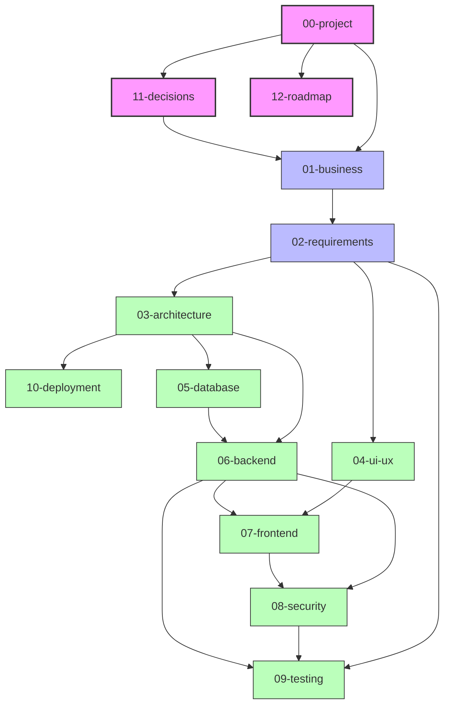

# Arquitectura Documental del Spec - Almacenes al Costo

Este documento define la estructura, organización y dependencias de la especificación técnica y funcional del proyecto **Almacenes al Costo**. Está diseñado bajo el enfoque de **Spec as a Skill** para servir como la única fuente de verdad (Single Source of Truth) y proporcionar instrucciones inequívocas para el desarrollo del sistema por agentes de IA o desarrolladores.

> **Estado del SPEC**: ✅ Revisión arquitectónica final completada. Listo para congelarse e iniciar implementación.

---

## 1. Estructura de Carpetas y Archivos

```
spec/
├── README.md                                 # Este mapa de navegación (Single Source of Truth)
├── 00-project/
│   ├── README.md                             # Introducción, alcance general y objetivos
│   ├── 01-vision-scope.md                    # Visión de negocio y límites del MVP
│   └── 02-glossary.md                        # Terminología del negocio y términos técnicos
├── 01-business/
│   ├── README.md                             # Propósito del modelado de negocio
│   ├── 01-business-rules.md                  # Reglas de negocio + ciclos de vida de Order y Payment ← FUENTE CANÓNICA DE ESTADOS
│   ├── 02-user-personas.md                   # Perfiles de Cliente y Administrador
│   └── 03-workflows.md                       # Flujo completo del Checkout + Flujo de validación manual
├── 02-requirements/
│   ├── README.md                             # Propósito de la especificación de requerimientos
│   ├── 01-functional-requirements.md         # RFC (cliente) y RFA (administrador)
│   ├── 02-non-functional-requirements.md     # Requerimientos no funcionales (rendimiento, seguridad)
│   └── 03-use-cases.md                       # Casos de uso clave (pago automático y manual)
├── 03-architecture/
│   ├── README.md                             # Propósito del diseño arquitectónico
│   ├── 01-system-architecture.md             # Arquitectura Strategy/Adapter del módulo de pagos
│   ├── 02-integration-diagrams.md            # Diagramas de secuencia: carga de comprobante y pasarela
│   ├── 03-directory-structure.md             # Mapa completo de directorios del proyecto Laravel
│   └── 04-webhooks.md                        # Especificación completa de webhooks (firma, idempotencia, reintentos)
├── 04-ui-ux/
│   ├── README.md                             # Propósito del diseño de interfaces
│   ├── 01-navigation-map.md                  # Grafo de navegación de Cliente y Administrador
│   ├── 02-design-system.md                   # Guía de Bootstrap 5, paleta cálida (Crema/Naranja) y tipografía
│   └── 03-screen-specs.md                    # Fichas de pantallas (Checkout, Success, Failed, Pending, Admin)
├── 05-database/
│   ├── README.md                             # Propósito del diseño de datos
│   ├── 01-entity-relationship.md             # Diagrama ER con cardinalidades documentadas
│   ├── 02-schema-definition.md               # DDL conceptual con índices recomendados ← FUENTE CANÓNICA DE TABLAS/ESTADOS
│   ├── 03-data-dictionary.md                 # Diccionario de datos por campo
│   └── 04-seeders-migrations.md              # Plan de migraciones ordenado + seeders
├── 06-backend/
│   ├── README.md                             # Propósito del backend
│   ├── 01-routes-map.md                      # Todas las rutas (públicas, protegidas, webhook)
│   ├── 02-controllers.md                     # Responsabilidades de controladores (sin lógica de negocio)
│   ├── 03-eloquent-models.md                 # Modelos Eloquent y relaciones ORM
│   ├── 04-services-helpers.md                # PaymentGatewayInterface, PaymentFactory, PaymentService, Adaptadores, DTOs
│   ├── 05-events.md                          # Catálogo de Laravel Events y Listeners
│   └── 06-jobs.md                            # Jobs asíncronos y Scheduled Tasks
├── 07-frontend/
│   ├── README.md                             # Propósito del frontend
│   ├── 01-blade-views.md                     # Jerarquía de vistas Blade
│   ├── 02-javascript-modules.md              # cart.js + checkout.js (anti-double-submit)
│   └── 03-bootstrap-custom.md               # Variables CSS y clases de la paleta cálida
├── 08-security/
│   ├── README.md                             # Propósito de la seguridad
│   ├── 01-auth-authorization.md              # Login administrativo y registro opcional de clientes
│   ├── 02-upload-security.md                 # Seguridad unificada: CSRF, XSS, SQL, PCI-DSS, webhooks, carga de archivos
│   └── 03-data-integrity.md                  # Controles de integridad de datos (OWASP)
├── 09-testing/
│   ├── README.md                             # Propósito de pruebas
│   ├── 01-test-plan.md                       # Estrategia de pruebas
│   └── 02-test-cases.md                      # 5 casos de prueba: checkout, comprobante, pasarela, fallo, idempotencia
├── 10-deployment/
│   ├── README.md                             # Propósito de configuración de entornos
│   ├── 01-env-variables.md                   # Variables .env (incluyendo credenciales de pasarelas)
│   └── 02-deployment-guide.md               # Guía de despliegue local (XAMPP)
├── 11-decisions/
│   ├── README.md                             # Propósito de los ADRs
│   ├── 01-adr-checkout-sin-cuenta.md         # Checkout inteligente sin registro obligatorio
│   ├── 02-adr-pago-manual.md                 # Pago manual (Superado por ADR-04)
│   ├── 03-adr-tecnologias.md                 # Stack tecnológico (Laravel + MySQL + Blade + Bootstrap 5)
│   └── 04-adr-integracion-pasarela.md        # Integración desacoplada de pasarelas (Strategy/Adapter)
└── 12-roadmap/
    ├── README.md                             # Propósito de la evolución
    ├── 01-mvp-release.md                     # Hitos de desarrollo del MVP
    └── 02-future-scope.md                    # Características post-MVP (couriers, facturación electrónica)
```

---

## 2. Fuentes Canónicas (Single Source of Truth)

> **Regla**: Cuando exista información duplicada entre documentos, la fuente canónica definida aquí tiene prioridad absoluta. Los demás documentos deben referenciarla.

| Información | Fuente Canónica |
| :--- | :--- |
| Estados de `orders.status` | `01-business/01-business-rules.md` → Sección 3.1 |
| Estados de `payments.status` | `01-business/01-business-rules.md` → Sección 3.2 |
| Correlación estados pedido/pago | `01-business/01-business-rules.md` → Sección 3.3 |
| DDL de tablas e índices | `05-database/02-schema-definition.md` |
| Diagrama ER | `05-database/01-entity-relationship.md` |
| Contrato de pasarelas | `06-backend/04-services-helpers.md` → Sección 2 |
| Responsabilidades por servicio | `06-backend/04-services-helpers.md` |
| Flujo de webhooks | `03-architecture/04-webhooks.md` |
| Controles de seguridad | `08-security/02-upload-security.md` |
| Variables de entorno | `10-deployment/01-env-variables.md` |

---

## 3. Dependencias entre Documentos



---

## 4. Observaciones Documentadas (para Codex)

1.  **Checkout sin login previo (RN-01)**: Desarrollar el flujo del cliente sin pantallas de inicio de sesión previas. El registro es opcional y exclusivamente en la pantalla de confirmación post-checkout.
2.  **WhatsApp (MVP)**: Implementar solo un enlace directo de WhatsApp Click-to-Chat en el footer y en el detalle de productos. No requiere integración de API de WhatsApp Business (eso es alcance futuro).
3.  **Webhook CSRF**: El endpoint `POST /api/payment/webhook/{gateway}` debe estar excluido explícitamente de `VerifyCsrfToken`. La autenticidad se garantiza por validación de firma HMAC.
4.  **Snapshot de precios**: La tabla `order_items` guarda el precio y nombre del producto al momento de la compra. No referenciar precios dinámicos de la tabla `products` para cálculos de órdenes existentes.
5.  **Colas en XAMPP local**: Configurar `QUEUE_CONNECTION=database`. Ejecutar `php artisan queue:work --queue=critical,default,emails` durante el desarrollo.
